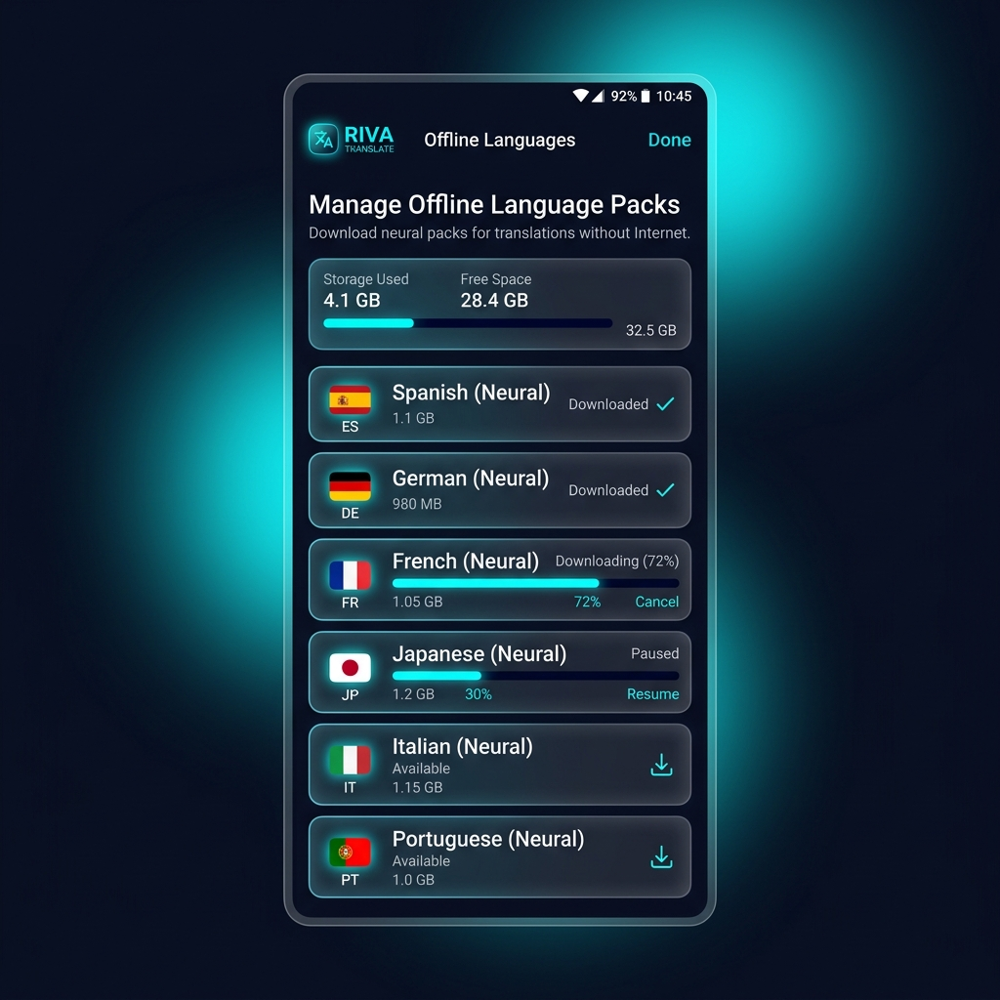
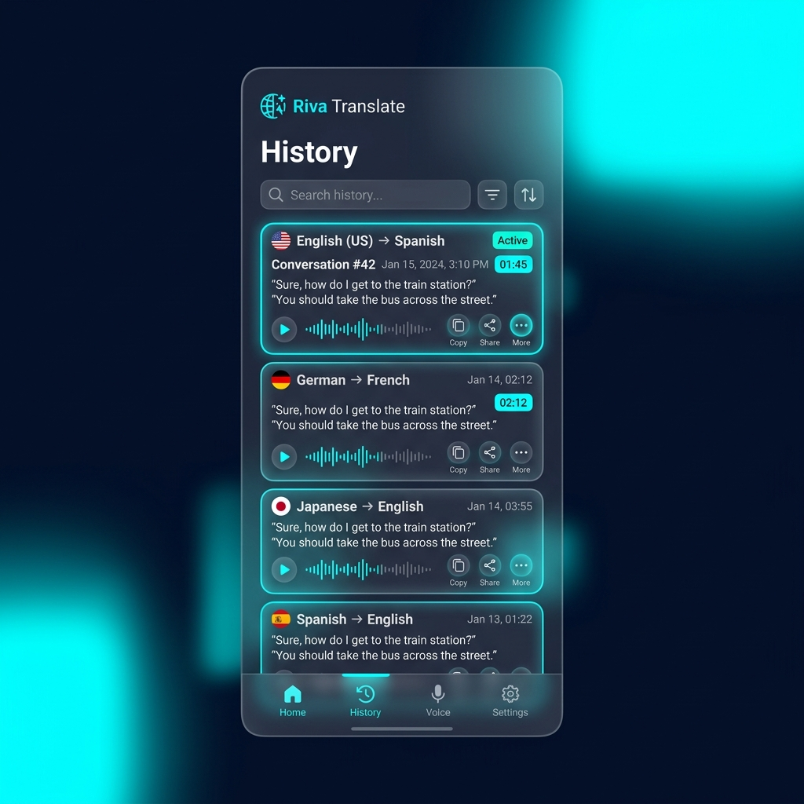

# Riva Translate 🌐

> **Real-time Multilingual Neural Translation & Voice Conversation Engine for Android**

Riva Translate is a state-of-the-art Android application engineered with **Kotlin**, **Jetpack Compose**, and **Material 3 Expressive Design**. Built for instant cross-cultural communication, Riva Translate combines real-time text translation, continuous live audio transcription, split-screen face-to-face conversation mode, offline neural language packages, and an interactive language learning studio with pronunciation scoring.

---

## 📱 Screenshots Gallery

### 🎨 Material 3 Expressive Screens (New Color Scheme Background)

| Home Text Translation | Live Continuous Audio | Face-to-Face Conversation |
| :---: | :---: | :---: |
|  |  |  |

| Language Learning Studio | Settings & Preferences | Offline Language Packs | Translation History |
| :---: | :---: | :---: | :---: |
|  |  |  |  |

---

### ✨ Classic Glassmorphism Screens (Original Textured Background)

| Home Text Translation | Live Continuous Audio | Face-to-Face Conversation |
| :---: | :---: | :---: |
|  |  |  |

| Language Learning Studio | Settings & Preferences | Offline Language Packs | Translation History |
| :---: | :---: | :---: | :---: |
|  |  |  |  |

---

## ⚡ Key Features

### 🔤 1. Text Translation Module
- **Instant Neural Translation**: Real-time translation between 15+ world languages (English, Spanish, French, German, Mandarin, Japanese, Korean, Hindi, Italian, Portuguese, Russian, Arabic, Turkish, Vietnamese, Thai).
- **One-Tap Language Swap & Auto-Detect**: Effortlessly switch source and target languages or auto-detect input language.
- **Voice-to-Text Dictation**: Quick speech input dialog with live microphone capture.
- **Rich Card Actions**: Copy translated text, trigger clear/paste, bookmark to favorites, and share via system intents.

### 🎙️ 2. Live Continuous Translation Session
- **Real-Time Sound Waveform Visualizer**: Live 24-bar audio frequency analyzer powered by Android `AudioRecord` PCM sampling.
- **Continuous Speech Recognition**: Hands-free live audio transcription and translation streaming.
- **Interactive Transcript History**: Live scrolling speech cards with individual voice playback buttons.
- **Export Transcripts**: One-tap text export dialog to copy or save full session transcripts.

### 🗣️ 3. Face-to-Face Conversation Mode
- **Dual-Orientation Split-Screen**: Features a top pane inverted by 180° for Speaker B and a bottom pane for Speaker A, ideal for placing a smartphone flat between two people.
- **Dual Independent Microphones**: Dedicated microphone triggers for Speaker A and Speaker B with active listening pulse animations.
- **Bilingual Chat Stream**: Integrated chat interface displaying original speech, translated text, timestamps, and speaker badges.

### 📦 4. Offline Language Packages
- **Internet-Free Translation**: Download local neural translation models directly onto the device.
- **Model Storage Manager**: View download progress, disk space utilization, and manage offline models (e.g., Spanish, French, German).

### 🎓 5. Language Learning & Pronunciation Studio
- **Interactive Flashcard Decks**: Practice daily common phrases with target language audio playback.
- **Pronunciation Coach & Scoring**: Record your voice speaking the target phrase and receive instant pronunciation accuracy feedback (0–100% score).
- **Daily Streak Tracker**: Stay motivated with daily streak counters and category progress tracking (Greetings, Dining, Travel, Business).

### ⚙️ 6. Customizable Preferences
- **4-Stage Voice Speed Slider**: Adjust Text-to-Speech output rate between `0.5x Slow`, `0.75x Moderate`, `1.0x Normal`, and `1.25x Fast`.
- **TTS Voice Gender Selector**: Choose between Female (♀) and Male (♂) voice profiles with dynamic pitch control.
- **Privacy & Security**: 100% local encrypted storage via Room Database. No microphone recordings or transcripts are uploaded to third-party cloud servers.

---

## 🎨 Material 3 Expressive Design System

- **Glassmorphism Atmosphere**: Deep dark canvas (`#070B14`) with animated ambient glowing radial liquid orbs.
- **Visually Emphasized Typography**: Custom M3 Expressive type scale (`displayLarge`, `displayMedium`, `displaySmall`) with high-contrast font weights and wide tracking labels.
- **Expanded Shape Library**: 28.dp extra-large rounded cards (`ExpressiveCardShape`), stadium capsule pills, and asymmetric speech bubble geometry (`ExpressiveAsymmetricLeftShape` & `ExpressiveAsymmetricRightShape`).
- **Bouncy Spring Motion Physics**: Touch interaction feedback powered by Compose spring physics (`Spring.DampingRatioMediumBouncy` & `Spring.StiffnessLow`).

---

## 🛠️ Tech Stack & Architecture

- **Language**: 100% Kotlin
- **UI Framework**: Jetpack Compose + Material 3 Expressive Components
- **Architecture**: MVVM (Model-View-ViewModel) + Clean Architecture
- **State Management**: Kotlin Coroutines, `StateFlow`, `collectAsStateWithLifecycle`
- **Database**: Room Persistence Library with KSP
- **On-Device Machine Learning**: Google ML Kit On-Device Translation API
- **Audio Processing**: Android `SpeechRecognizer`, `TextToSpeech` (TTS), `AudioRecord` PCM Amplitude Engine

---

## 🚀 Getting Started

### Prerequisites
- **Android Studio**: Ladybug (2024.2.1) or newer
- **JDK**: Version 17
- **Min SDK**: API Level 24 (Android 7.0+)
- **Target SDK**: API Level 34 / 35 (Android 14 / 15)

### Installation & Build

1. **Clone the Repository**:
   ```bash
   git clone https://github.com/your-username/riva-translate.git
   cd riva-translate
   ```

2. **Open in Android Studio**:
   Open Android Studio, select **Open an Existing Project**, and choose the cloned `riva-translate` directory.

3. **Build and Run**:
   Sync Gradle dependencies and run the app on an Android device or emulator:
   ```bash
   ./gradlew assembleDebug
   ```

---

## 📁 Directory Structure

```text
riva-translate/
├── app/
│   ├── src/
│   │   └── main/
│   │       ├── java/com/example/
│   │       │   ├── audio/              # Audio recorder, TTS, and Speech Recognition
│   │       │   ├── data/               # Room database entities, DAOs, repository
│   │       │   ├── model/              # Domain models, Enums, UI State models
│   │       │   ├── ui/
│   │       │   │   ├── components/     # Glassmorphism & M3 Expressive UI components
│   │       │   │   ├── screens/        # Home, Live, Face-To-Face, History, Learning, Settings
│   │       │   │   ├── theme/          # Color tokens, Typography, M3 Theme
│   │       │   │   └── viewmodel/      # TranslationViewModel state manager
│   │       │   └── MainActivity.kt     # Main activity & screen router
│   │       └── res/                    # Drawables, layouts, string resources
├── screenshots/                        # App screenshot previews for documentation
├── build.gradle.kts                    # Root Gradle build file
└── README.md                           # Documentation
```

---

## 🔒 Privacy Policy Summary

Riva Translate prioritizes user privacy above all else. All microphone recordings, audio files, and translation transcripts created during Live and Conversation sessions are stored strictly on the user's local device storage inside encrypted Room databases. No voice recordings or private transcripts are ever sold or transmitted to external third-party servers.

---

## 📄 License

Distributed under the MIT License. See `LICENSE` for more information.
